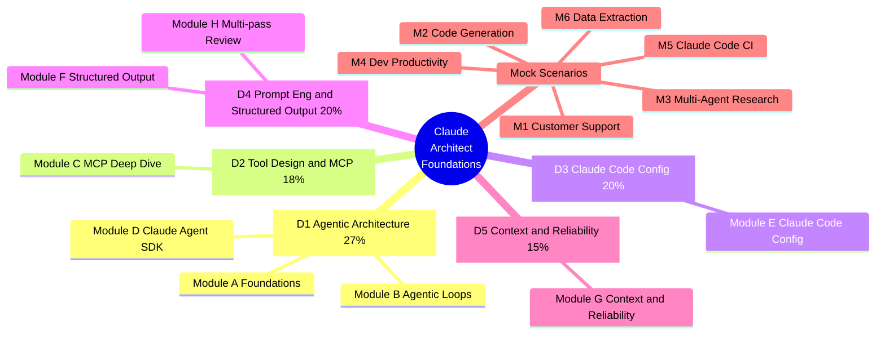
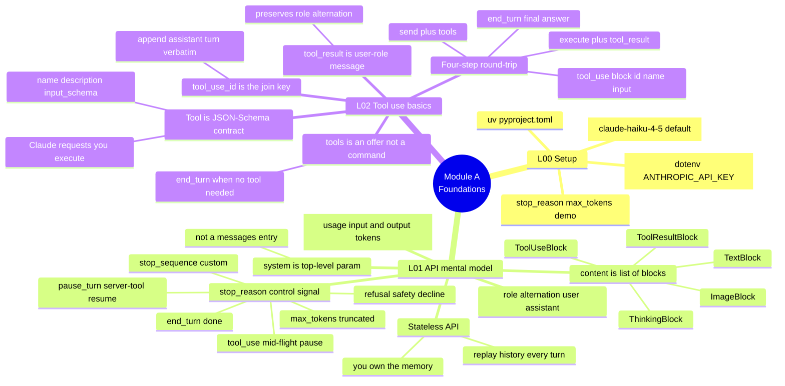
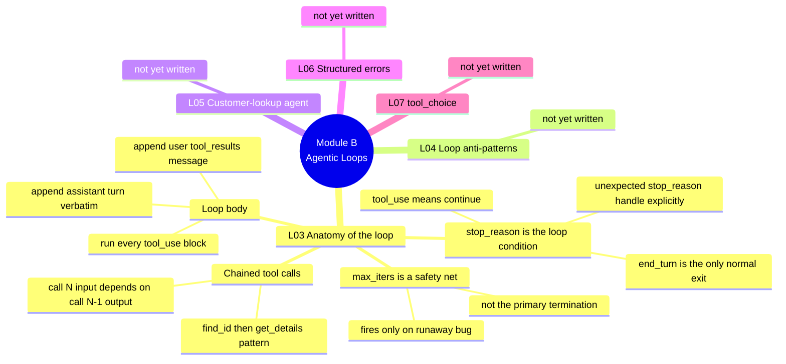
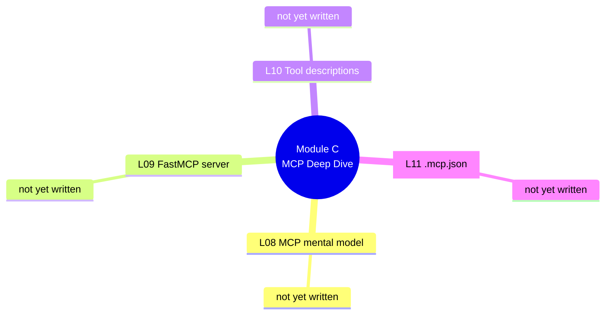
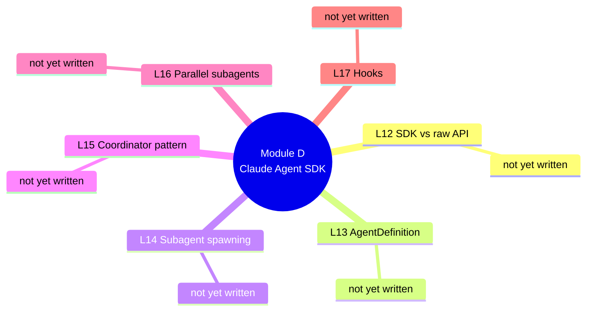
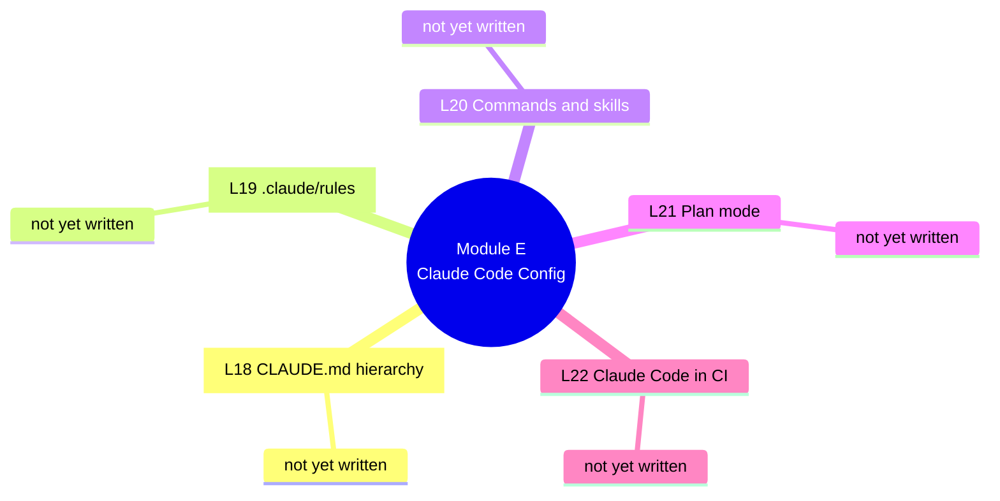
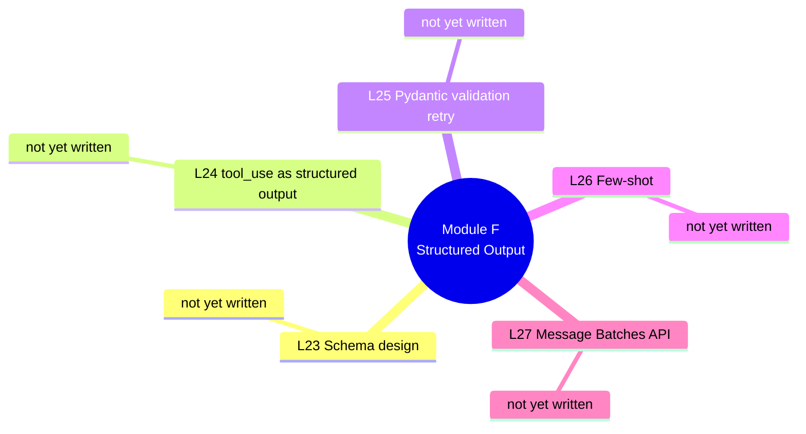
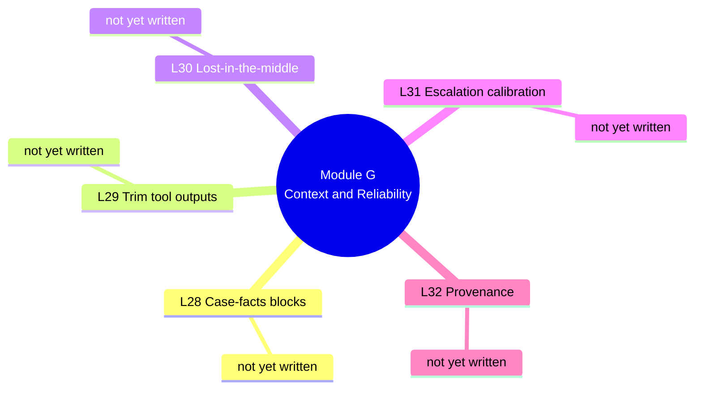
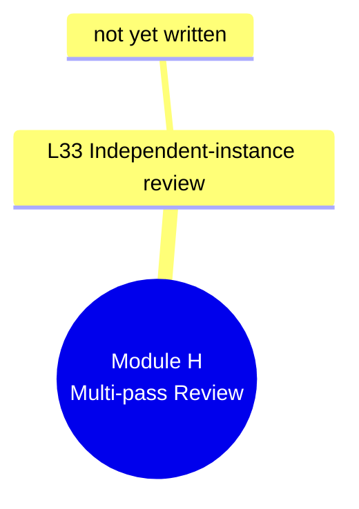
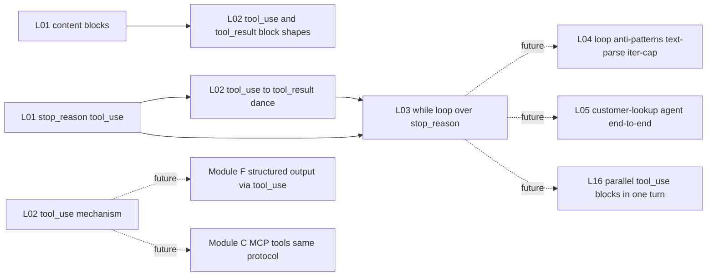

# Curriculum Mind Map

Hierarchical mind map for the Claude Certified Architect — Foundations curriculum. One overview map establishes the spine (5 domains → modules); one detail map per module captures the actual concept leaves. Cross-domain integration points live in the final section.

**How to read it**: start with the overview to anchor yourself, then drill into whichever module you're currently studying or revising. Use the Cross-links section as your exam-prep deck — those edges are where multi-domain questions live.

**Update cadence**: Claude adds concept leaves to a module's detail map at the end of each lesson, and adds any cross-domain edges discovered. You can re-arrange/prune at module boundaries.

**Rendering**: VS Code's Markdown preview (Cmd+Shift+V) renders Mermaid natively in recent versions, or via the *Markdown Preview Mermaid Support* extension. Mermaid `mindmap` chokes on characters like `+ % & : / ( ) ,` — when in doubt, wrap a node label in `["..."]`.

---

## Overview — domains and modules

---

## Module A — Foundations (D1 prereqs)

Lessons 00–02. Environment setup, API mental model, tool-use basics. Foundation for every later module.

## Module B — Agentic Loops (D1 core)

Lessons 03–07. The heart of D1 — the highest-weighted domain. The loop pattern, anti-patterns, error handling, and tool_choice.

## Module C — MCP Deep Dive (D2)

Lessons 08–11. MCP protocol, authoring servers with FastMCP, tool-description craft, `.mcp.json` configuration.

## Module D — Claude Agent SDK (D1 advanced)

Lessons 12–17. Higher-level orchestration: AgentDefinition, subagent spawning, coordinator and parallel patterns, hooks.

## Module E — Claude Code Configuration (D3)

Lessons 18–22. CLAUDE.md hierarchy, rules, commands and skills, plan mode, CI usage. Heavy weight; Rich is fluent on the day-to-day surfaces but exam tests specifics.

## Module F — Structured Output and Extraction (D4)

Lessons 23–27. Schema design, tool_use as the structured-output mechanism, Pydantic validation, few-shot, Batches API.

## Module G — Context and Reliability (D5)

Lessons 28–32. Case-facts blocks, output trimming, lost-in-the-middle, escalation calibration, provenance.

## Module H — Multi-pass and Self-Review (D4 advanced)

Lesson 33. Independent-instance review; per-file and cross-file passes.

---

## Cross-links (the exam-rewarding part)

Edges between concepts in *different* modules. Add one whenever a lesson reveals an integration point. Dotted edges (`-.->`) are forward-looking placeholders; solid edges (`-->`) are confirmed integration points discovered in a lesson.

---

## Revision notes (free-form)

Scratch area for things that don't fit the tree — analogies that landed, comparisons to Next.js patterns, "this would be a trap question" observations. Append-only.

- *(nothing yet)*
